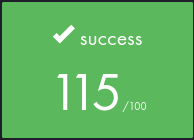
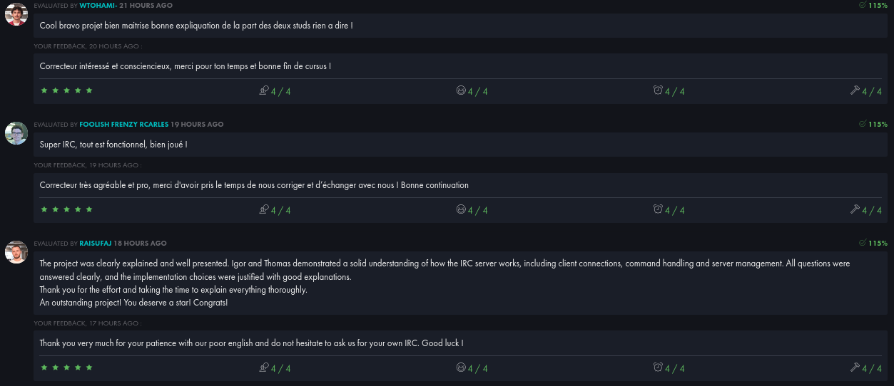
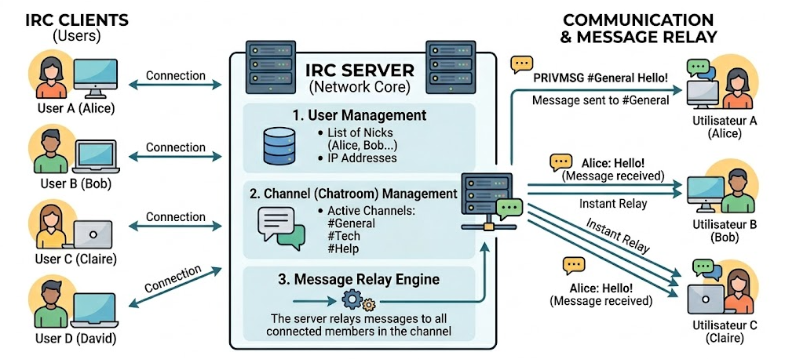
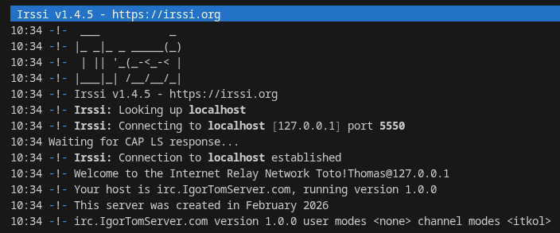

*This project has been created as part of the 42 curriculum by ikayiban and tclouet.*

# Description

*This section presents the project, its goals, and a brief overview :*

The ft_irc project aims to build a small IRC server, capable of handling multiple Irssi clients simultaneously.

Each client must be able to connect, authenticate, join a channel and chat with other users.

# Instructions

*This section contains information about compilation, installation, and/or execution:*

*Before starting, please ensure that Irssi is installed.*

1. #### **In the root directory, compile the program with:**

	`make`

2. #### **Run the executable as follows:**

	`./ircserv <port> <password>`

#### Note:
	The port number must be between 1024 and 65535.

3. #### **Connect to the server with Irssi:**

	`/connect localhost <port> <password>`

4. #### **The server responds with a welcome message:**

5. #### **Available commands:**
 
	- Change your nickname:	`/nick <newnickname>`

	- Join a channel: `/join #channel`

	- Send a private message to a specific user: `/msg <nickname> <message>`

6. #### **Available commands (channel operators only):**

	- Exclude a user from a channel: `/kick <nickname>`

	- Invite a user to join a channel: `/invite <nickname>`

	- Check the current topic, delete it or edit it: `/topic [: :newtopic]`

	- Change the channel modes: `/mode [+ -] [i t k o l] [parameters]`

		- [+ -] : Set or remove a mode.

		- [ i ] : Set/remove invite-only mode.

		- [ t ] : Set/remove the restrictions of the TOPIC command to channel operators.

		- [ k ] : Set/remove the channel key (password).

		- [ o ] : Give/take channel operator privilege.

		- [ l ] : Set/remove the user limit for the channel.

#### Note:
	<parameters> only apply to the k, o, and l modes (ex: /mode +k <key>)

# Resources

*This section lists references related to the topic, as well as a description of how AI has been used :*

- [What is IRC?](https://fr.wikipedia.org/wiki/Internet_Relay_Chat)
- [What is an IRC client?](https://fr.wikipedia.org/wiki/Client_IRC)
- [Learn about sockets.](https://www.google.com/search?client=ubuntu&channel=fs&q=coder+un+serveur+c%2B%2B#fpstate=ive&vld=cid:d1a7501b,vid:oYBgV474Udc,st:0)
- [Network programming guide.](http://vidalc.chez.com/lf/socket.html)
- [How to code a server?](https://www.google.com/search?client=ubuntu&channel=fs&q=coder+un+serveur+c%2B%2B#fpstate=ive&vld=cid:d1a7501b,vid:oYBgV474Udc,st:0)
- [RFC 1459](https://www.rfc-editor.org/rfc/rfc1459.html#section-6)
- [RFC 2812](https://www.rfc-editor.org/rfc/rfc2812)
- [IRSSI documentation.](https://irssi.org/documentation/)
- [How to use Netcat?](https://blog.stephane-robert.info/docs/securiser/reseaux/analyse/netcat/)
- [MAN](https://man7.org/linux/man-pages/index.html)

#### **Use of AI :**  
AI helped us generate a diagram of the project and understand some definitions in the MAN and RFCs. It also helped us better understand the behavior of Irssi and why some requests were not being sent to the server.

# Team Contribution

This project was developed collaboratively by **ikayiban** and **tclouet**. The work was divided as follows:

- **ikayiban** implemented the client and channel logic and also the join, privmsg, part and quit commands.

- **tclouet** implemented the server logic and also the pass, nick, user, kick, invite, topic and mode commands.

- Both team members collaborated on implementing utility functions such as log display to facilitate debugging.

This project was our second collaboration. It allowed us to strengthen our team spirit and communication skills, while also developing our technical skills. 
